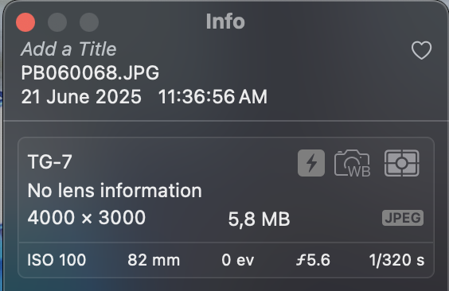

Recently I tried <a href="https://immich.app/" target="_blank">Immich</a> as a potential solution for storing my photos. I am currently an Apple Photos user and as such I thought it would be a seamless experience to export all my photos and videos to my self-hosted Immich instance.

I was wrong.

Upon uploading my stuff on Immich I realized that a lot of my photos and videos weren't dated properly and it wasn't just a day or two offset, it was a complete mess.

To save some data inside a photo, a standard has been created: Exif (**EX**changeable **I**mage file **F**ormat). Basically this standard specifies a way to write and read various information within an image or a video (captured using a digital device). These metadata can cover a broad spectrum:

- Camera settings: model, aperture, shutter speed, focal length, ISO speed information, etc.
- Image data: dimensions, resolution, colorspace
- Date and time information
- Location information

There's a tool called <a href="https://exiftool.org/" target="_blank">exiftool</a> that allows people to read and write the Exif metadata of an image or video.

That's the tool I used when I began my investigation. Unfortunately the date information of my files weren't making any sense.

Here's the date of one of my photos as displayed in Apple Photos:



I exported this photo from Apple Photos and used <a href="https://exiftool.org/" target="_blank">exiftool</a> to read its Exif data. Here's what running the `exiftool -time:all PB060068.JPG` command shows:

```text
File Modification Date/Time     : 2023:11:06 00:01:08+01:00
File Access Date/Time           : 2025:08:07 12:43:46+02:00
File Inode Change Date/Time     : 2025:08:07 12:40:30+02:00
Modify Date                     : 2023:11:06 01:01:09
Date/Time Original              : 2023:11:06 01:01:09
Create Date                     : 2023:11:06 01:01:09
Offset Time                     : +09:00
Offset Time Original            : +09:00
Offset Time Digitized           : +09:00
Date Time UTC                   : 2023:11:05 16:01:09
Create Date                     : 2023:11:06 01:01:09+09:00
Date/Time Original              : 2023:11:06 01:01:09+09:00
Modify Date                     : 2023:11:06 01:01:09+09:00
```

As you can see, it's a complete mess, there's no mention of the valid date in the Exif data. Furthermore, some dates are set in 2023 whereas the picture was taken in June 2025. That must mean that Apple Photos use something else to store the picture's date.

Enter the IIM data (**I**nformation **I**nterchange **M**odel) or commonly known as IPTC. It's a file structure and set of metadata that can be applied to some media types. Although at first it was intended for use with all types of news items, the standard soon became used by photographers. Information like the name of the photographer and potential copyright information can be embedded either manually or automatically within these metadata. Most of the photo editing softwares can read and write these metadata.

Today, the e**X**tensible **M**etadata **P**latform (XMP) has replaced the IPTC file structure, but the image attributes from IPTC are still included in the core schema for XMP.

On Apple Photos there's an option that allows the exporting of the IPTC metadata along with the photos and videos. An exported photo (or video) will get one file for the content itself and one file with the IPTC data. Both of the files have the same name, only the extension change (`.xmp` for the IPTC data).

Here's what the IPTC data look like for the same photo:

```xml
<x:xmpmeta xmlns:x="adobe:ns:meta/" x:xmptk="XMP Core 6.0.0">
   <rdf:RDF xmlns:rdf="http://www.w3.org/1999/02/22-rdf-syntax-ns#">
      <rdf:Description rdf:about=""
            xmlns:dc="http://purl.org/dc/elements/1.1/"
            xmlns:photoshop="http://ns.adobe.com/photoshop/1.0/">
         <photoshop:DateCreated>2025-06-21T11:36:56+02:00</photoshop:DateCreated>
      </rdf:Description>
   </rdf:RDF>
</x:xmpmeta>
```

There it is! The date that I need is burried inside another metadata file and not within the photo metadata itself. Thanks Apple!

Now in order to fix my date issue I just need to extract the valid date from the IPTC metadata and update the photo Exif metadata date fields.

To do this, I created two scripts. The first one scans the XMP files in a specified directory, extracts the date information from the `<photoshop:DateCreated>` tag, matches each XMP to its corresponding media file and write the information inside a CSV file for easier processing. The second script uses said CSV file to update the Exif date metadata for each media file.

After processing, here's what the Exif date information look like:

```text
File Access Date/Time           : 2025:08:07 12:33:07+02:00
File Inode Change Date/Time     : 2025:08:07 12:31:04+02:00
Modify Date                     : 2025:06:21 11:36:56
Date/Time Original              : 2025:06:21 11:36:56
Create Date                     : 2025:06:21 11:36:56
Offset Time                     : +09:00
Offset Time Original            : +09:00
Offset Time Digitized           : +09:00
Date Time UTC                   : 2023:11:05 16:01:09
Create Date                     : 2025:06:21 11:36:56+09:00
Date/Time Original              : 2025:06:21 11:36:56+09:00
Modify Date                     : 2025:06:21 11:36:56+09:00
```

That fixed the mismatching dates issue I encountered on Immich.

I put those scripts on <a href="https://github.com/ebacala/apple-photos-exif-date-updater" target="_blank">GitHub</a> if you ever need it. On my end it was a fun little investigation that allowed me to learn a bit more on Exif and IPTC metadata.
