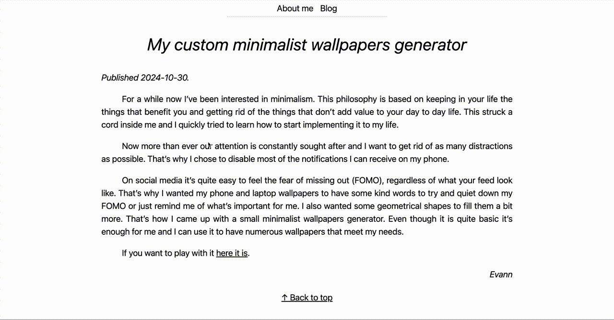

This one will be short. 

Since I started my personal website, I've encountered something non-esthetic: a Flash Of Unstyled Text (you might encounter the FOUT acronym on your search results). At the time of writing, this website uses the <a href="https://github.com/dbenjaminmiller/garamond-libre" target="_blank">GaramondLibre font</a> with a subset of glyphs so that the font files are smaller. Upon navigating between pages of my website, I've noticed that the fallback font is displayed for a fraction of a second before the GaramondLibre font is loaded.

Here's what it looks like:



Here's my CSS that defines the GaramondLibre font-family:

```css
@font-face {
  font-family: "GaramondLibre";
  font-style: normal;
  font-weight: 400;
  font-display: swap;
  src: local("GaramondLibre"), url("/fonts/GaramondLibre-Regular.woff2") format("woff2");
}

@font-face {
  font-family: "GaramondLibre";
  font-style: normal;
  font-weight: 700;
  font-display: swap;
  src: local("GaramondLibre"), url("/fonts/GaramondLibre-Bold.woff2") format("woff2");
}

@font-face {
  font-family: "GaramondLibre";
  font-style: italic;
  font-weight: 400;
  font-display: swap;
  src: local("GaramondLibre"), url("/fonts/GaramondLibre-Italic.woff2") format("woff2");
}
```

The culprit is the `font-display: swap` property. It tells the browser to show a fallback font immediately and then swap to the custom font when it loads. We can change this to `font-display: block` so that the browser will wait for the font to load before displaying the text.

```css
@font-face {
  font-family: "GaramondLibre";
  font-style: normal;
  font-weight: 400;
  font-display: swap; // [!code --]
  font-display: block; // [!code ++]
  src: local("GaramondLibre"), url("/fonts/GaramondLibre-Regular.woff2") format("woff2");
}

@font-face {
  font-family: "GaramondLibre";
  font-style: normal;
  font-weight: 700;
  font-display: swap; // [!code --]
  font-display: block; // [!code ++]
  src: local("GaramondLibre"), url("/fonts/GaramondLibre-Bold.woff2") format("woff2");
}

@font-face {
  font-family: "GaramondLibre";
  font-style: italic;
  font-weight: 400;
  font-display: swap; // [!code --]
  font-display: block; // [!code ++]
  src: local("GaramondLibre"), url("/fonts/GaramondLibre-Italic.woff2") format("woff2");
}
```

A simple fix to a simple non-esthetic issue.