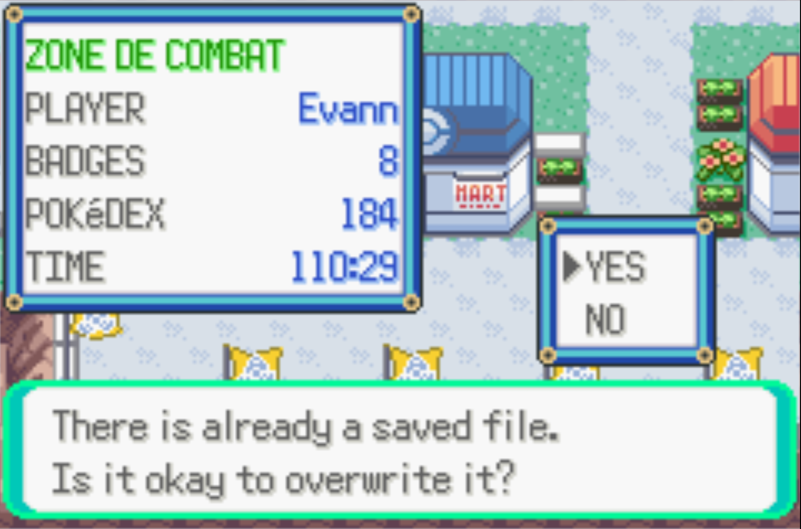
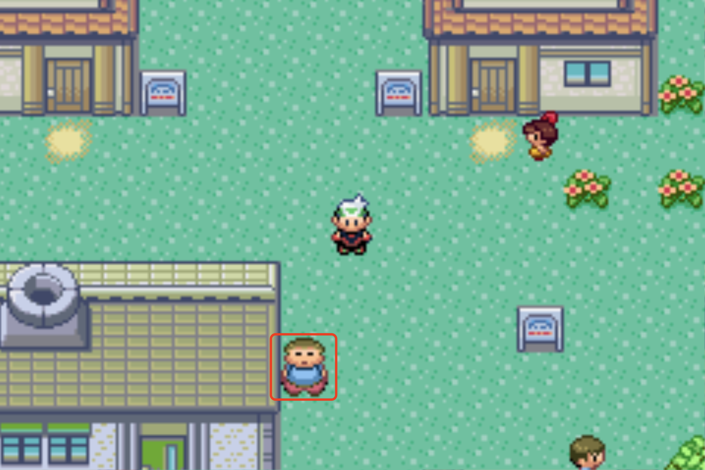

## Introduction

My first experience with a Pokémon game was in 2006. I remember playing Pokémon Fire Red on a Gameboy Advance SP in a video game store while my parents were grocery shopping. Of course every week some kid started a new game and I kept doing the beginning of the game over and over. You can say I was ecstatic when I was gifted Pokémon Emerald and got to play my first real adventure in a Pokémon world.

When growing up, I got to play other video games but somehow it seemed I would always come back to playing Pokémon Emerald, starting a new game every year or so.

Recently I started once again a new game, this time on an emulator so that I didn’t need to pack my GBA everywhere (I still kept the cartridge out of nostalgia). This time the more I played the more I felt frustrated with some of the game features. For example, I have never ever traded Pokémons with friends, so I never got to complete my Pokédex as some Pokémons can only evolve through trading. Another thing is that PP Ups can't be bought with money, and it bothered me that I couldn't max out my Pokémons moves when farming XP. 

These are only a few things that bothered me, the more I kept playing the more I found little things that could be improved for a either a better game experience or a better game logic.

A year or so ago, I watched a YouTube video about how a guy modified the game so that it had the first Pokémon of its team follow him like in Pokémon Heartgold and Soulsilver (for the curious it was <a href="https://www.youtube.com/watch?v=2tpBooD_X7k&pp=ygUicG9rZW1vbiBlbWVyYWxkIHBva2Vtb24gZm9sbG93IHlvdQ%3D%3D" target="_blank">this video</a>). Naturally, being a developer I thought "if this guy did it, why can't I adapt the game to my needs?". And that is exactly what I did, I resolved my frustations one at a time.

## Setting up the project

Thanks to the <a href="https://pret.github.io" target="_blank">team Pret guys</a>, Pokémon Emerald has been decompiled and put on Github in <a href="https://github.com/pret/pokeemerald" target="_blank">this repository</a>. I just had to fork the project and set it up on my computer to be ready to change the game. Their installation documentation is quite thorough, I just created a script and a Docker compose file to be up and running more efficiently (and be more OS-agnostic)

If you want to do the same thing you can clone the <a href="https://github.com/pret/pokeemerald" target="_blank">repository</a> and create a few files in the base folder:

```dockerfile title=Dockerfile copy=true
FROM debian:12-slim

RUN apt update && apt install -y build-essential binutils-arm-none-eabi git libpng-dev gdebi-core wget
RUN wget https://apt.devkitpro.org/install-devkitpro-pacman && chmod +x ./install-devkitpro-pacman && echo "Y" | ./install-devkitpro-pacman
RUN git clone https://github.com/pret/agbcc

WORKDIR /agbcc

RUN chmod +x build.sh install.sh
RUN ./build.sh
RUN ./install.sh /pokeemerald
```

```yaml title=docker-compose.yaml copy=true
services:
  pokemaker:
    container_name: pokemaker
    build:
      context: .
      dockerfile: Dockerfile
    volumes:
      - .:/pokeemerald
    command: tail -f /dev/null
```

```bash title=build.sh copy=true
#!/bin/bash

docker compose up -d
docker exec -it pokemaker /bin/bash -c "cd /pokeemerald && make"
```

Now all you have to do is run `./build.sh` to build the game (the compilation part happens in the Docker container).

## My adaptations to the game

### Translation

This project is a decompilation of the English version of the game. I am French and I grew up playing the French version of Pokémon. Even though I do speak English now, I'm still used to the French Pokémons names, same thing for their moves, abilities and natures. So that's the first thing I changed. It is not difficult to change the text, it is just tedious. The files will look like this:

```c title=src/data/text/species_names.h
const u8 gSpeciesNames[][POKEMON_NAME_LENGTH + 1] = {
  [SPECIES_NONE] = _("??????????"),
  [SPECIES_BULBASAUR] = _("BULBASAUR"), // [!code --]
  [SPECIES_IVYSAUR] = _("IVYSAUR"), // [!code --]
  [SPECIES_VENUSAUR] = _("VENUSAUR"), // [!code --]
  ...
  [SPECIES_BULBASAUR] = _("BULBIZARRE"), // [!code ++]
  [SPECIES_IVYSAUR] = _("HERBIZARRE"), // [!code ++]
  [SPECIES_VENUSAUR] = _("FLORIZARRE"), // [!code ++]
  ...
};
```

```c title=src/data/text/nature_names.h
static const u8 sHardyNatureName[] = _("HARDY"); // [!code --]
static const u8 sLonelyNatureName[] = _("LONELY"); // [!code --]
static const u8 sHardyNatureName[] = _("HARDI"); // [!code ++]
static const u8 sLonelyNatureName[] = _("SOLO"); // [!code ++]
...
```

```c title=src/data/text/move_names.h
const u8 gMoveNames[MOVES_COUNT][MOVE_NAME_LENGTH + 1] =
{
  [MOVE_NONE] = _("-"),
  [MOVE_POUND] = _("POUND"), // [!code --]
  [MOVE_KARATE_CHOP] = _("KARATE CHOP"), // [!code --]
  [MOVE_POUND] = _("ECRAS'FACE"), // [!code ++]
  [MOVE_KARATE_CHOP] = _("POING-KARATE"), // [!code ++]
  ...
};
```

```c title=src/data/text/abilities.h
static const u8 sNoneDescription[] = _("No special ability."); // [!code --]
static const u8 sStenchDescription[] = _("Helps repel wild Pokémon."); // [!code --]
...
static const u8 sNoneDescription[] = _("Pas de talent."); // [!code ++]
static const u8 sStenchDescription[] = _("Repousse Pokémon sauvage."); // [!code ++]
```

A few hundred translations is what it took for me to get a basic enjoyment of the modified game. Now I have a bastardised version of the game where all the text is in English except for the Pokémons names, moves, abilities and natures, but it doesn't bother me at all.

### Removing the overwrite save confirmation dialog

This one is a tiny teeny frustration. But it is one of the first things I changed to get me acquainted with the project files. 



When you overwrite a save file, the game asks you to confirm. I found that kind of annoying, so I removed it.

```c title=src/start_menu.c
...
static u8 SaveFileExistsCallback(void)
{
  if (gDifferentSaveFile == TRUE)
  {
    ShowSaveMessage(gText_DifferentSaveFile, SaveConfirmOverwriteDefaultNoCallback);
  }
  else
  {
    ShowSaveMessage(gText_AlreadySavedFile, SaveConfirmOverwriteCallback); // [!code --]
    sSaveDialogCallback = SaveSavingMessageCallback; // [!code ++]
  }
  return SAVE_IN_PROGRESS;
}
...
```

Instead of asking me if I really want to overwrite my save file, it now just skip to the saving message and the actual saving of the game.

### Allow PP Ups buying

Like I said in the [introduction](#introduction), in the end-game, it is frustrating to not be able to max out my Pokémons moves PPs. Luckily, it is very easy to change. I decided to only have the Battle Frontier Pokémart sell PP Ups (as it is supposed to be where the best trainers are, might as well give them the best items to buy). It only takes a line of code to add PP Ups to the list of sold items by this Pokémart.

```plaintext title=data/maps/BattleFrontier_Mart/scripts.inc
BattleFrontier_Mart_Pokemart:
	.2byte ITEM_ULTRA_BALL
	.2byte ITEM_HYPER_POTION
	.2byte ITEM_MAX_POTION
	.2byte ITEM_PP_UP // [!code ++]
  ...
```

Each line represent an item that can be bought at the Pokémart. Later on, I decided to have this specific Pokémart sell numerous more items, useful for battling of completing the Pokédex more easily. These are the items that I decided to add :

- All the evolution stones
- Deep Sea Tooth & Deep Sea Scale (₽10,000 each)
- All the TMs
- Ether (₽2,500) & Max Ether (₽5,000)
- Elixir (₽5,000) & Max Elixir (₽10,000)

You can see that I also changed the price the Ethers and Elixirs are sold for. I chose to do that because I thought that they were quite underpriced compared to their actual value. To do so is quite simple, I just needed to change the price in the items header file, for example for the Ether:

```c title=src/data/items.h
...
[ITEM_ETHER] =
   {
    .name = _("ETHER"),
    .itemId = ITEM_ETHER,
    .price = 1200, // [!code --]
    .price = 2500, // [!code ++]
    .holdEffectParam = 10,
    .description = sEtherDesc,
    .pocket = POCKET_ITEMS,
    .type = ITEM_USE_PARTY_MENU,
    .fieldUseFunc = ItemUseOutOfBattle_PPRecovery,
    .battleUsage = ITEM_B_USE_MEDICINE,
    .battleUseFunc = ItemUseInBattle_PPRecovery,
},
...
```

A little fun fact is that this file sets the Master Ball price to 0, making it quite literally priceless and so unsellable.

### Trade with myself

Growing up, I never traded Pokémons to get some of them to evolve so I never completed the Pokédex. And now in 2024, good luck finding someone to trade with. The solution to that is simple: finding a way to trade with myself. It is a bit harder to implement though. <a href="https://www.pokecommunity.com/goto/post?id=10215480" target="_blank">TheMaxan on pokecommunity.com</a> provided a great way to achieve this. Kudos to them!

The first step is to find an NPC (non-playable character) that is not crucial for the game story completion. I chose the "Fat Man" (that's not me, it is how he's called in the source code 🤷‍♂️) in Littleroot Town.



Now we have to change its dialog script to make him ask me if I want to trade with myself using the script written by TheMaxan.

```c title=data/maps/LittlerootTown/scripts.inc
LittlerootTown_EventScript_FatMan::
	msgbox LittlerootTown_Text_CanUsePCToStoreItems, MSGBOX_NPC // [!code --]
	goto SCRIPT_SelfTrade_V1 // [!code ++]
	end

SCRIPT_SelfTrade_V1:: // [!code ++]
	lock // [!code ++]
	faceplayer // [!code ++]
	msgbox SCRIPT_SelfTrade_Text_IllTradeIfYouWant, MSGBOX_YESNO // [!code ++]
	compare VAR_RESULT, NO // [!code ++] 
	goto_if_eq SCRIPT_SelfTrade_DeclineTrade // [!code ++]
	special ChoosePartyMon // [!code ++]
	waitstate // [!code ++]
	compare VAR_0x8004, 255 // [!code ++]
	goto_if_eq SCRIPT_SelfTrade_DeclineTrade // [!code ++]
	copyvar VAR_0x8005, VAR_0x8004 // [!code ++]
	setvar VAR_0x8004, 6 // [!code ++]
	special CreateInGameTradePokemon // [!code ++]
	special DoInGameTradeScene // [!code ++]
	waitstate // [!code ++]
	msgbox SCRIPT_SelfTrade_Text_ComeBack, MSGBOX_DEFAULT // [!code ++]
	release // [!code ++]
	end // [!code ++]
...
```

I didn't include the other scripts that are part of the self-trade, these ones handle the dialog flow (yes/no) and the dialog boxes. 

```c
special ChoosePartyMon
```

The `ChoosePartyMon` function is a special macro that loads the screen asking the player to choose a Pokémon in their team. It returns the index of the Pokémon they chose in the `VAR_0x8004` buffer adress. If they didn't choose any Pokémon (ie: exited the screen), it will return `255`.

```c
compare VAR_0x8004, 255
goto_if_eq SCRIPT_SelfTrade_DeclineTrade
copyvar VAR_0x8005, VAR_0x8004
setvar VAR_0x8004, 6
```

This next bit is a conditional that checks if the `VAR_0x8004` value is `255`. If it is then we load a dialog the indicate that the player has declined the trade. Otherwise we copy the `VAR_0x8004` value to `VAR_0x8005` and set `VAR_0x8004` to `6` (it is an indicator to say that the player did a trade with themselves).

```c title=src/trade.c
...
void CreateInGameTradePokemon(void)
{
  CreateInGameTradePokemonInternal(gSpecialVar_0x8005, gSpecialVar_0x8004); // [!code --]
  if(gSpecialVar_0x8004 == 6) // [!code ++]
    gEnemyParty[0] = gPlayerParty[gSpecialVar_0x8005]; // [!code ++]
  else // [!code ++]
    CreateInGameTradePokemonInternal(gSpecialVar_0x8005, gSpecialVar_0x8004); // [!code ++]
}
...
```

Here we are inside the function handling the Pokémon trade. If the `VAR_0x8004` value is `6` then we set the Pokémon of the trade partner to the chosen Pokémon in our team, effectively making the player trade with themselves. Otherwise we load the normal trade process.

### Conclusion

These are just a few things I changed to make the game more enjoyable for me. I made other changes, and I might share them in a future blog post. It has been a really fun experience to tinker with my favourite game and see the actual results of my coding.